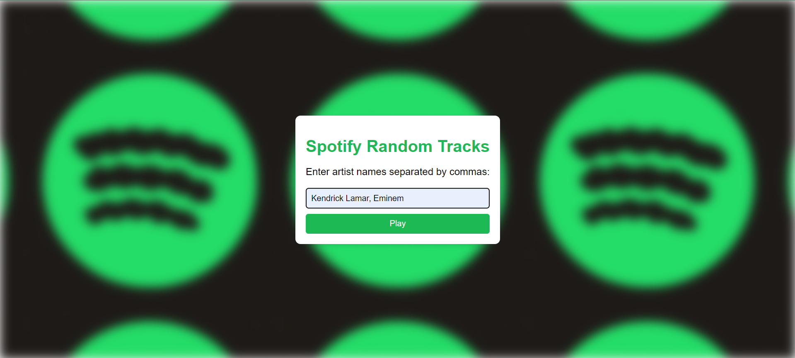

# Spotify Random Tracks Player

A web application built with Flask that plays random tracks from specified artists on Spotify. Users can enter multiple artist names, and the app will fetch and play a random selection of their songs using the Spotify API.

## Features

- Enter multiple artist names separated by commas.
- Fetch random tracks from the specified artists.
- Play the selected random tracks using Spotify's playback API.
- Simple and elegant UI with a blurred background effect.

## Setup and Installation

### Prerequisites

- Python 3.x
- Spotify Developer Account

### Installation

1. Clone the repository:
    ```sh
    git clone https://github.com/amanchoudhary1727/Spotify-Random-Tracks-Player.git
    cd spotify-random-tracks
    ```

2. Create and activate a virtual environment:
    ```sh
    python -m venv venv
    source venv/bin/activate  # On Windows use `venv\Scripts\activate`
    ```

3. Install the dependencies:
    ```sh
    pip install -r requirements.txt
    ```

4. Set up your Spotify API credentials:
    - Create a new Spotify app at [Spotify Developer Dashboard](https://developer.spotify.com/dashboard/applications).
    - Set the Redirect URI to `http://localhost:8888/callback`.
    - Note your `CLIENT_ID` and `CLIENT_SECRET`.

5. Update `app.py` with your Spotify credentials:
    ```python
    CLIENT_ID = 'your-client-id'
    CLIENT_SECRET = 'your-client-secret'
    ```

### Running the Application

1. Start the Flask app:
    ```sh
    python app.py
    ```

2. Open your web browser and go to `http://localhost:5000`.

### Usage

- Enter artist names separated by commas in the input field.
- Click the "Play" button to fetch and play random tracks from the specified artists.

## Screenshots

  <!-- Add a screenshot of your app here -->

## License

This project is licensed under the MIT License. See the [LICENSE](LICENSE) file for details.

## Contributing

Contributions are welcome! Please open an issue or submit a pull request for any improvements or bug fixes.

## Acknowledgments

- [Spotipy](https://spotipy.readthedocs.io/en/2.19.0/#) for the Python library to interact with Spotify's API.
- [Unsplash](https://unsplash.com) for the background image.
